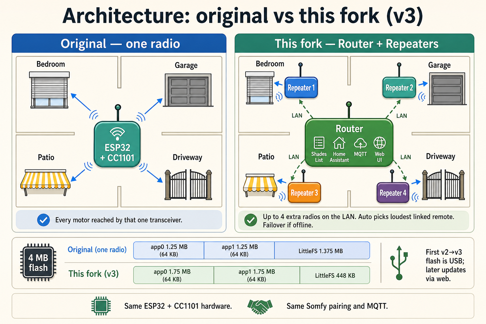
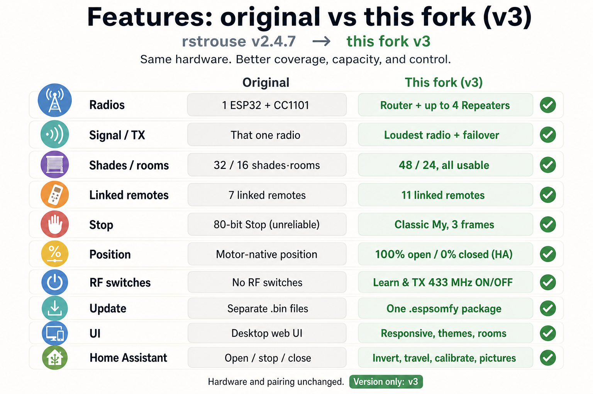
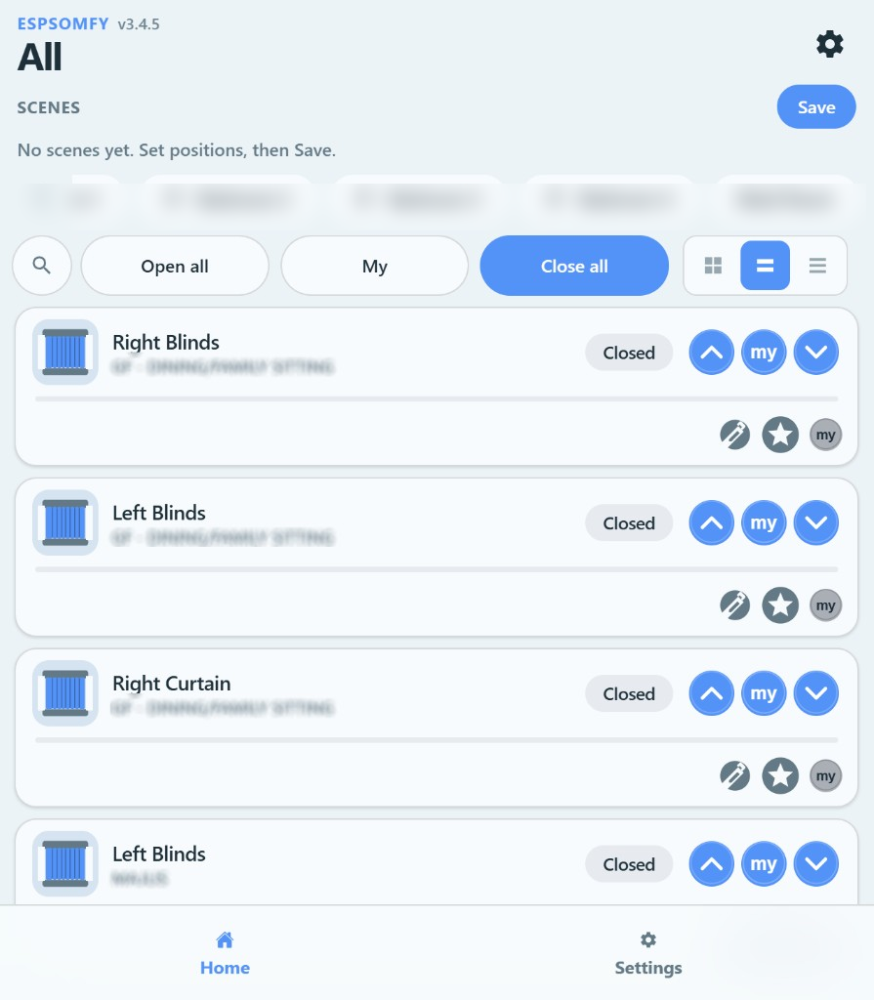
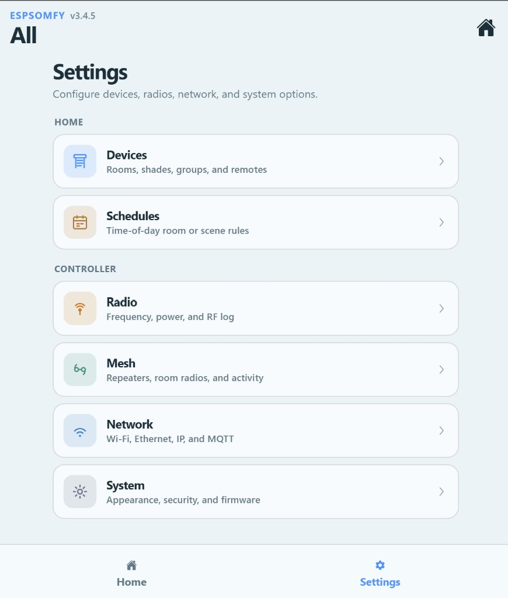
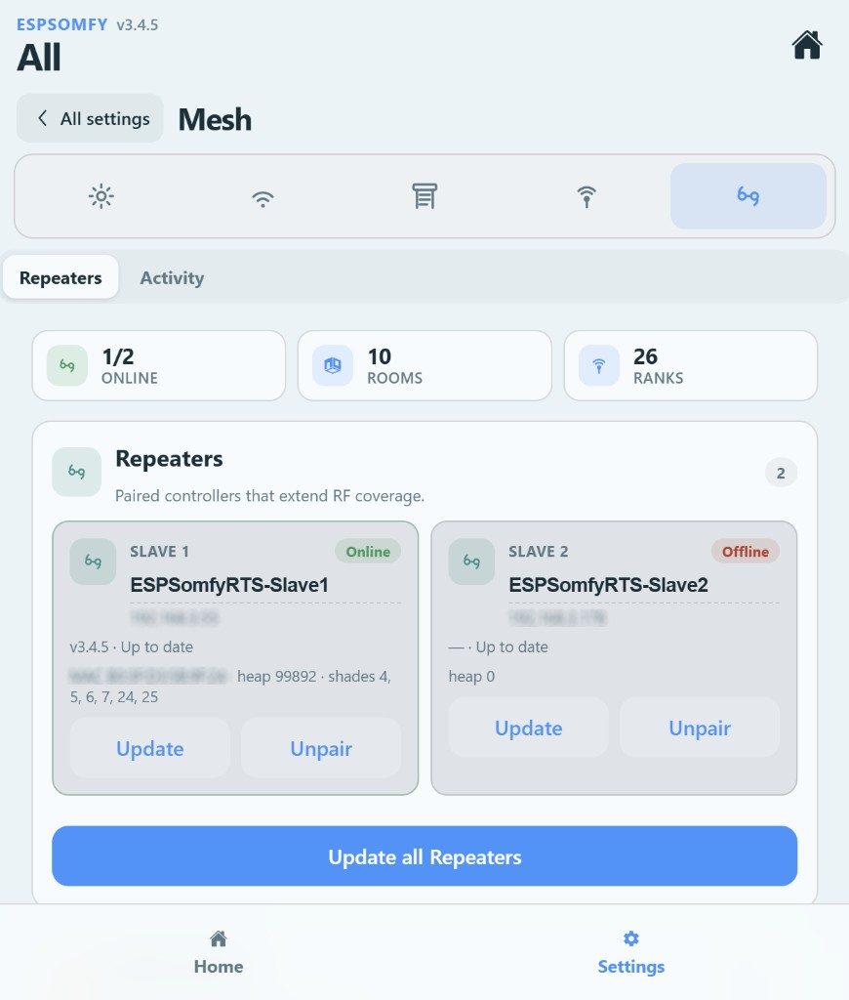

# ESPSomfy-RTS

Community fork of [rstrouse/ESPSomfy-RTS](https://github.com/rstrouse/ESPSomfy-RTS) for **large homes**: more shades, mesh radios, scenes, and a modern web UI.

[](https://github.com/jcvsite/ESPSomfy-RTS/releases)
[](https://github.com/jcvsite/ESPSomfy-RTS-HA/releases)
[](LICENSE)

**Current:** firmware **v3.4.5** · board `esp32dev` (4 MB) · [CHANGELOG](CHANGELOG.md) · [HA integration v2.6.1](https://github.com/jcvsite/ESPSomfy-RTS-HA)

> **Important:** This fork uses a **new flash layout**. First install is always **USB**. You cannot jump here with web Manual Update / GitHub OTA from the original or other community firmwares.

---

## Quick start

| Your situation | What to do |
|---|---|
| **New / blank ESP32** | [Flash a new device](#flash-a-new-device) (USB + onboard zip) |
| **Coming from rstrouse / another fork** | [Migrate once over USB](#migrate-from-another-firmware) (Backup → flash → Restore) |
| **Already on this fork (v3)** | [Update over Wi‑Fi](#update-on-this-fork-wi-fi) (`.espsomfy` only) |


Hardware wiring and Somfy pairing are unchanged — see the [original wiki](https://github.com/rstrouse/ESPSomfy-RTS/wiki).

---

## What you get

| | Original (v2.4.7) | This fork |
|---|---|---|
| Shades / rooms | 32 / 16 | **48 / 24** |
| Radios | One ESP32 | **Router + up to 4 Repeaters** |
| Room / scene TX | Truncated batches | On-device **RF queue** (all motors) |
| Scenes / schedules | — | Up to **8** each |
| RF switches | — | Learn / TX 433 MHz ON/OFF |
| Web UI | Classic multi-language | Redesigned Settings/Home (**English**) |
| Position scale | Motor-native | **100% open / 0% closed** (HA-aligned) |
| First install | Separate bins | **USB onboard image**; later updates `.espsomfy` |

Unchanged: ESP32 + CC1101, Somfy pairing, MQTT topics, original wiki for wiring.

### Architecture & features





### Web UI

| Home | Settings | Mesh |
|---|---|---|
|  |  |  |

---

## Flash a new device

Use this for a **blank chip** or a board that has never run this fork.

### You need

- ESP32 + CC1101 (same hardware as the original project)
- USB cable that carries data
- Chrome or Edge (for ESPHome Web)
- Latest **onboard** zip from [Releases](https://github.com/jcvsite/ESPSomfy-RTS/releases)  
  Example: `SomfyController.onboard.esp32-v3.4.5.bin.zip`

> Pick the zip that matches your chip: `esp32`, `esp32c3`, `esp32s3_4mb`, `esp32s3_8mb`, …

### Steps (recommended — no PlatformIO)

1. **Download** the versioned onboard zip for your board from Releases.
2. **Unzip** it. Inside you need `SomfyController.onboard.bin`  
   (bootloader + partition table + firmware + filesystem).
3. Open **[ESPHome Web](https://web.esphome.io/)** → connect the board over USB.
4. Choose **Install** → **Prepare for first use** is fine on a blank chip → then install your **custom** `.bin`.  
   Do **not** install ESPHome’s own firmware.
5. When it reboots, join the board’s Wi‑Fi hotspot (or wait until it joins yours if already configured) and open the web UI — usually `http://espsomfyrts.local` or the SoftAP address shown on serial.
6. Complete the **first-run wizard**: **Router** (main hub) or **Repeater** (extra radio only).

### After first boot

1. Set Wi‑Fi / Ethernet under **Settings → Network**.
2. Pair motors in **Settings → Devices** (same flow as the [original wiki](https://github.com/rstrouse/ESPSomfy-RTS/wiki/Configuring-the-Software)).
3. Optional: add [Home Assistant](https://github.com/jcvsite/ESPSomfy-RTS-HA), MQTT, or Mesh Repeaters.

### PlatformIO alternative (developers)

```bash
python -m platformio run -t upload -e esp32dev
python -m platformio run -t buildfs -t uploadfs -e esp32dev
```

---

## Migrate from another firmware

Coming from **rstrouse**, **xkain**, or any non‑v3 build? Web OTA **cannot** rewrite the partition table. Do this **once per board** (Router and each Repeater).

### Steps

1. On the **old** firmware: **Backup** and save the `.backup` file.
2. Flash the **same onboard zip** as a new device ([ESPHome Web](#steps-recommended--no-platformio) or PlatformIO above).  
   Prefer **no full erase** so Wi‑Fi in NVS can survive.
3. Open the new web UI → **Restore** that `.backup`.
4. Confirm radio GPIOs under **Settings → Radio** if needed.

Shades, rooms, groups, and remote addresses come back from the backup. You do **not** need to re-pair every motor if Restore succeeds.

### Do not

- Upload a v3 `.espsomfy` onto a device still on another fork’s map.
- Expect the old web updater to install this release.

---

## Update on this fork (Wi‑Fi)

Already running **this fork’s v3** map? Use the web UI — no USB.

1. Download `SomfyController.esp32-vX.Y.Z.espsomfy` from [Releases](https://github.com/jcvsite/ESPSomfy-RTS/releases)  
   (or build locally — see below).
2. Open the device → **Settings → System → Firmware → Manual Update**.
3. Choose the `.espsomfy` file and confirm.

**Backup first** when the UI asks — shade data lives on LittleFS.

GitHub OTA (check for updates) is **off** by default. Enable it only if you want the device to pull from this repo’s releases.

### Build the package yourself

```bash
python -m platformio run -e esp32dev
python -m platformio run -t buildfs -e esp32dev
```

Upload:

```text
.pio/build/esp32dev/SomfyController.esp32.espsomfy
```

CC1101 driver **3.0.2** is default. Fallback **2.5.7**:

```bash
python -m platformio run -e esp32dev-cc1101v257
python -m platformio run -t buildfs -e esp32dev-cc1101v257
```

### Release file names

| File | When to use |
|---|---|
| `SomfyController.onboard.esp32-vX.Y.Z.bin.zip` | **USB first install / migration** |
| `SomfyController.esp32-vX.Y.Z.espsomfy` | **Wi‑Fi Manual Update** (already on this fork) |
| `SomfyController.ino.esp32-vX.Y.Z.bin` | Firmware-only (advanced) |
| `SomfyController.littlefs-vX.Y.Z.bin` | Filesystem-only (advanced; wipes shade files if flashed over USB) |

Only **versioned** assets are published. Do not use unversioned / other-fork packages.

Flash **Router and Repeaters** with the same release when mesh behavior changes.

---

## Mesh (Router + Repeaters)

- **Router** — shades, Home Assistant, MQTT, web UI, scenes, schedules.
- **Repeater** — extra RF only (no shade list on its Home screen).

Pair Repeaters with the Router login. On the Router: **Settings → Mesh → Repeaters** — set each room to **Auto** (best radio) or lock it to a unit. Link a physical Somfy remote on each shade so Auto / Activity can learn RSSI.

---

## Home Assistant

Use **[jcvsite/ESPSomfy-RTS-HA](https://github.com/jcvsite/ESPSomfy-RTS-HA) v2.6.1+** with this firmware (not the stock HA component if you want invert, calibrate, room covers, scenes, FixedCode).

### Voice

- **With HA:** HA Cloud Alexa (or a skill) → expose covers.
- **Without HA:** Router → **Network → Alexa** (Hue bridge, max 24 shades). Don’t mix Hue bridge and HA Alexa on the same motors.

---

## Hardware & pairing

Same as upstream:

- [Simple hardware guide](https://github.com/rstrouse/ESPSomfy-RTS/wiki/Simple-ESPSomfy-RTS-device)
- [Installing the firmware](https://github.com/rstrouse/ESPSomfy-RTS/wiki/Installing-the-Firmware) *(use this fork’s USB / `.espsomfy` steps above instead of their bins)*
- [Configuring the software](https://github.com/rstrouse/ESPSomfy-RTS/wiki/Configuring-the-Software)
- [Integrations](https://github.com/rstrouse/ESPSomfy-RTS/wiki/Integrations)

IO Home Control is not native.

---

## Backup & restore

- Always **Backup** before USB filesystem flash or major upgrades.
- USB `uploadfs` / onboard image **replaces LittleFS** — Restore brings shades back.
- Backups from this fork and rstrouse v2.4.x restore on this firmware.

---

## Credits

Built on [rstrouse/ESPSomfy-RTS](https://github.com/rstrouse/ESPSomfy-RTS). Earlier UI/PlatformIO work from [xkain/ESPSomfy-RTS](https://github.com/xkain/ESPSomfy-RTS).

- Firmware: [jcvsite/ESPSomfy-RTS](https://github.com/jcvsite/ESPSomfy-RTS)
- Home Assistant: [jcvsite/ESPSomfy-RTS-HA](https://github.com/jcvsite/ESPSomfy-RTS-HA)
